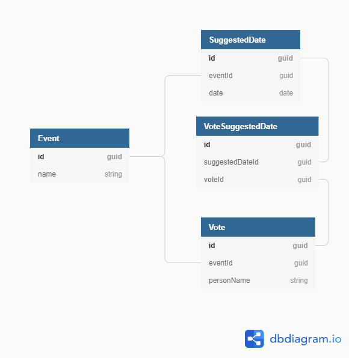

# EventSuffle API

Quick start: run the `Eventsuffle.Web` project in VisualStudio 2019. 

Alternatively install the .NET Core SDK (3.1.2), build, and run the app:

1) `dotnet build .`
2) `dotnet run --project .\src\Eventsuffle.Web\Eventsuffle.Web.csproj --urls http://*:8080`

Navigate to [http://localhost:8080/swagger/index.html](http://localhost:8080/swagger/index.html).

By default, the app uses an in memory database. You can, however, use an MS SQL DB for persisting data.
Set your MS SQL DB connection settings into `appsettings.secret.json` file next to the Web project's
`appsettings.json` file.

## People

- Arto Salminen, arto.salminen@gmail.com

## License

All rights reserved.

## Architecture

The solution follows Microsoft's Clean Architecture sometimes referred to as Onion Architecture. It is a layered architecture that breaks
the application into three main projects: user interface (UI), business logic layer (BLL), and data access layer (DAL).

These three projects in this solution are:

- UI - [Eventsuffle.Web](./src/EventSuffle.Web/Eventsuffle.Web.csproj)
  - Contains API controllers and ViewModels
- BLL - [Eventsuffle.Core](./src/Eventsuffle.Core/Eventsuffle.Core.csproj)
  - Contains business logic services and entity POCOs
- DAL - [Eventsuffle.Infrastructure](./src/EventSuffle.Infrastructure/Eventsuffle.Infrastructure.csproj)
  - Contains the database context and migrations

Note that in Clean Architecture the BLL should not depend on implementation details written into DAL or UI.
In contrary, one of the key principles is that -- thanks to dependency inversion -- DAL and UI (or Web API in this case)
implementations depend on the BLL.

For more details see this [link](https://docs.microsoft.com/en-us/dotnet/architecture/modern-web-apps-azure/common-web-application-architectures#clean-architecture) to Microsoft documentation.

## Libraries and Frameworks

- .NET Core 3.1.2
- EF Core 3.1.2 (ORM)
- Swashbuckle (Swagger API Explorer)
- Serilog (for logging)

## Tools

- VisualStudio 2019
- [NSwagStudio](https://github.com/RicoSuter/NSwag/wiki/NSwagStudio)
  [NSwag](https://github.com/RicoSuter/NSwag) is a Swagger/OpenAPI 2.0 and 3.0 toolchain for .NET, .NET Core, Web API, ASP.NET Core, 
  TypeScript (jQuery, AngularJS, Angular 2+, Aurelia, KnockoutJS and more) and other platforms

  In this project, NSwag is used to generate the API client for functional tests.

## Development Details

You can run the app in VisualStudio 2019 by setting the Eventsuffle.Web project as a start project
and then running the application.

### Database structure

Database tables are described in [dbdiagram.io](https://dbdiagram.io/) markup as follows

```
Table Event as E {
  id guid [pk]
  name string
}

Table SuggestedDate as D {
  id guid [pk]
  eventId guid [ref: - E.id]
  date date
}

Table VoteSuggestedDate {
  id guid [pk]
  suggestedDateId guid [ref: - D.id]
  voteId guid [ref: - V.id]
}

Table Vote as V {
  id guid [pk]
  eventId guid [ref: - E.id]
  personName string
}
```



### Tests

Under the '/tests' folder, you'll find test projects for functional and unit tests. Test can be
run either with VisualStudio test runner or from command line with .NET Core Runtime (at the root of the repository):

`dotnet test .\test\Eventsuffle.FunctionalTests\Eventsuffle.FunctionalTests.csproj`

`dotnet test .\test\Eventsuffle.UnitTests\Eventsuffle.UnitTests.csproj`

To generate new test API client with NSwagStudio first run the EventSuffle API. 
Then open the `test\Eventsuffle.FunctionalTests\Eventsuffle.ApiClient.nswag`
and generate new output files. The client should be placed right next to the `.nswag` file. 
Remember to save the new `Eventsuffle.ApiClient.nswag` file as well.

### Migrations

Add a migration by running at the repository root folder:

``` 
dotnet ef migrations add (NAME_OF_MIGRATION) --context EventSuffleMicrosoftSqlDbContext -p ./src/Eventsuffle.Infrastructure/Eventsuffle.Infrastructure.csproj -s ./src/Eventsuffle.Web/Eventsuffle.Web.csproj -o Migrations/MsSqlMigrations
```
3. If you want to remove the latest migration, run:
```
 dotnet ef migrations remove --context EventSuffleMicrosoftSqlDbContext -p ./src/Eventsuffle.Infrastructure/Eventsuffle.Infrastructure.csproj -s ./src/Eventsuffle.Web/Eventsuffle.Web.csproj
```
4. If you want to modify the db, run:
```
dotnet ef database update --context EventSuffleMicrosoftSqlDbContext -p ./src/Eventsuffle.Infrastructure/Eventsuffle.Infrastructure.csproj -s ./src/Eventsuffle.Web/Eventsuffle.Web.csproj
```
